# control_flow

## control flow statements are the backbone of making decisions in programming. it directs the order in which commands or instructions are execute in a script.
 ### The command use are: 
 - Read: is used to capture user input and stored it in a variable.

- -gt: this is a greater comparism operator.
- -p: display command back in the screen
- -it: it is a less operator
## loops: they are fundamental constructs that allowws us to repeat a set of commands muiltiple times.
 ### They are three type of loops
 - for
 - while
 - until

 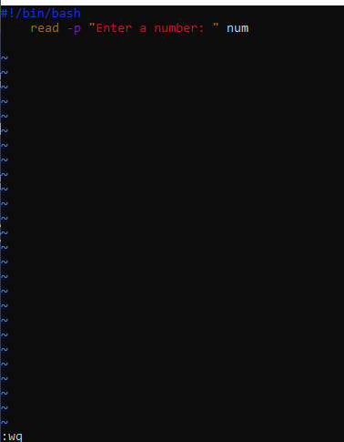

 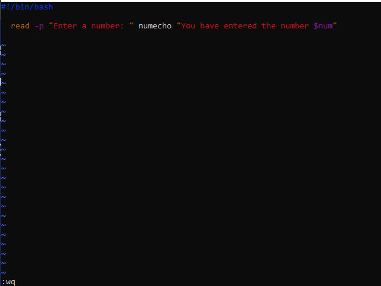

 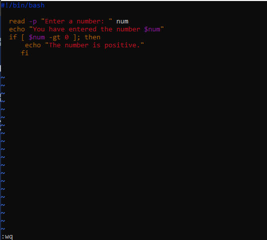

 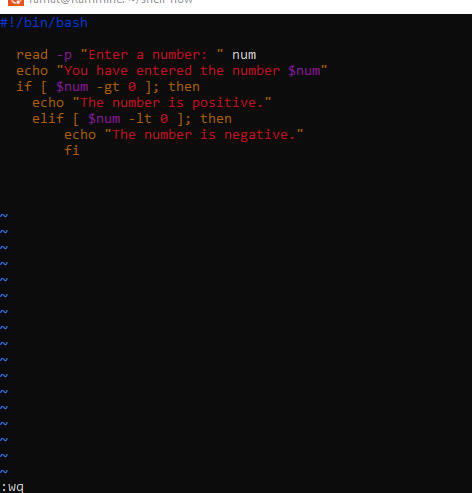

 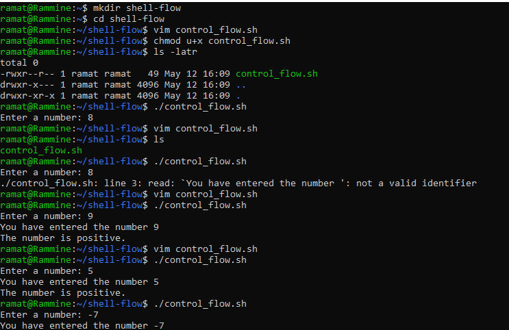

 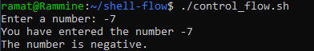

 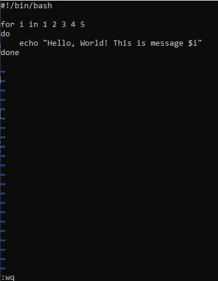

 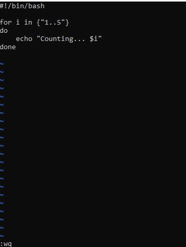

 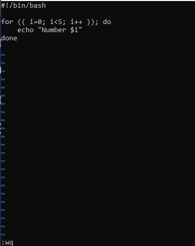

 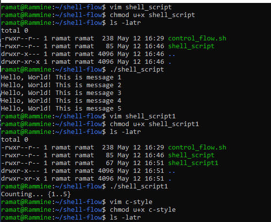

 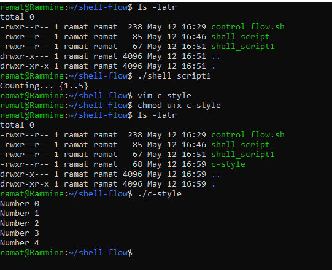

 